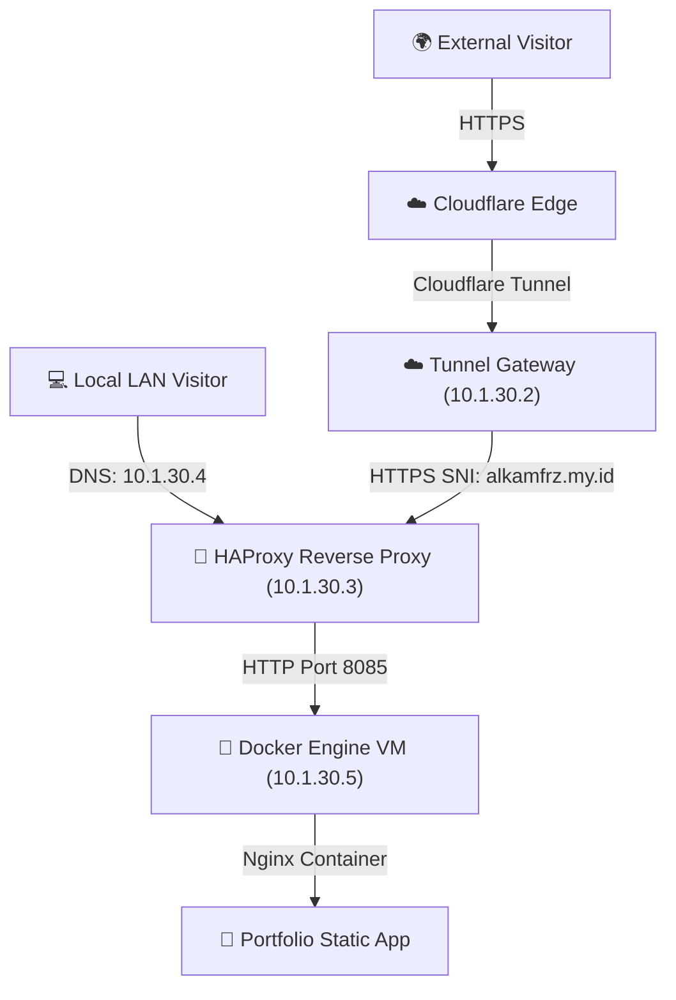

# 🌌 Personal Developer Portfolio (alkamfrz.my.id)
## Product Requirements Document (PRD) & Architecture Specification

This document serves as the absolute source of truth for the personal developer portfolio website, detailing the product requirements, design guidelines, E2E testing framework, and the self-hosted deployment architecture.

---

## 🏛️ 1. Product & Architecture Overview

The personal portfolio is a responsive, high-performance static web application built using **Astro v6**, **React**, and **Vanilla Scoped CSS**. It is self-hosted on a Proxmox/Docker homelab under the primary domain `alkamfrz.my.id` and features automatic deployments.

### Ingress Traffic Architecture
* **DNS Resolution**: 
  - *Internal (LAN)*: Technitium DNS resolves `alkamfrz.my.id` directly to HAProxy (`10.1.30.3`).
  - *External (WAN)*: Cloudflare DNS points to Cloudflare Tunnel.
* **Public Ingress**: 
  - External requests enter through Cloudflare Edge.
  - Forwarded securely via **Cloudflare Tunnel (`cfd-tng` - `10.1.30.2`)** to HAProxy.
* **Reverse Proxy**: 
  - **HAProxy (`haproxy-tng` - `10.1.30.3`)** terminates SSL using Let's Encrypt certificates.
  - Proxies traffic over HTTP to the Docker hostVM at port `8085`.
* **Application Host**: 
  - Runs as a Docker container on the **Docker host (`docker-tng` - `10.1.30.5`)** on port `8085`.



---

## 🛠️ 2. Core Functional Requirements

### R1. Responsive Multi-Page Navigation
The site provides three main pages with client-side active class detection:
* **Home (`/`)**: Landing page presenting summary details.
* **Projects (`/projects`)**: Complete projects showcase.
* **Blog (`/blog`)**: Markdown-based developer blog catalog.
* **Header / Navigation**: Features a dynamic logo (ID `#logo-link`), desktop navigation links, and a responsive React mobile hamburger menu toggle.

### R2. Pages Specification

#### 1. Home Page (`/`)
Must contain the following sections in this exact order:
1. **Hero**: Fits the full viewport height. Features a dual-color gradient heading (`text-gradient` class), secondary subtitle, decorative gradient background orbs (pure CSS), and CTA buttons routing to `/projects` and `/blog`.
2. **About**: Biography section introducing development interests and home-server/homelab virtualization experience.
3. **Skills (`#skills-section`)**: Dynamically lists skill badges under categories (e.g., Languages, Frameworks, DevOps) loaded from `src/data/skills.js`. Badges use `glass-card` styling.
4. **Projects Preview (`#projects-grid`)**: Renders up to 3 featured projects from `src/data/projects.js` as glassmorphism cards. Includes titles, descriptions, tech stack badges, GitHub source links (class `github-link`), and Live Demo links (class `live-link`). Includes a redirection link to `/projects`.
5. **Blog Preview (`#blog-preview-section`)**: Renders the 2 most recent blog posts from markdown, displaying the title, formatted date (e.g., `"June 1, 2026"`), short description, and a "Read More" link (class `read-more`).
6. **Contact Form (`#contact-form`)**: Interactive React component (`ContactForm.jsx`) with client-side validation.
   - **Fields**: Name (`#contact-name`), Email (`#contact-email`), and Message (`#contact-message`) with dedicated validation error spans.
   - **Submission**: Sends a JSON POST request to `/api/contact` appending active URL search query parameters (e.g., `?status=500` for testing integration).
   - **Feedback**: Displays a submission status div (`#contact-status`) with class `success` or `error` depending on response.
   - **Social links**: Outbound anchors pointing to GitHub, LinkedIn, and an email link (`mailto:alkam.fariz@outlook.com`).

#### 2. Projects Page (`/projects`)
* Displays all project cards in a responsive grid (`#projects-grid`).
* Supports empty states (`#no-projects` showing `No projects found` text).
* Includes page title matching `"Projects"`.

#### 3. Blog Catalog Page (`/blog`)
* Displays all blog posts in a grid (`#blog-grid`) sorted newest first.
* Supports empty states (`#no-posts` showing `No posts found` text).
* Displays post date formatted as `"Month DD, YYYY"`.
* Includes page title matching `"Blog"`.

#### 4. Blog Post Details Page (`/blog/[slug]`)
* Renders the post title in an `h1` element and the markdown body in a container with class `blog-post-detail`.

#### 5. 404 Page (`/404.html`)
* Serves a custom not-found card (`#not-found-card`) displaying `404` and a return home link (`#go-home-link`).

---

## 🎨 3. Design System & Styling Spec

Styling relies exclusively on **Vanilla Scoped CSS** and global design tokens inside `src/styles/global.css`.

### Tokens & Colors
```css
:root {
  --bg-dark: #0a0b10;
  --bg-card: rgba(255, 255, 255, 0.03);
  --border-card: rgba(255, 255, 255, 0.08);
  --text-primary: #f8fafc;
  --text-secondary: #94a3b8;
  --accent-blue: #3b82f6;
  --accent-purple: #8b5cf6;
  --gradient-accent: linear-gradient(135deg, var(--accent-blue), var(--accent-purple));
  --font-sans: 'Outfit', 'Inter', system-ui, -apple-system, sans-serif;
}
```

### Key Styling Classes
* **`glass-card` / `project-card`**: Apply `backdrop-filter: blur(12px)` with a transparent background and micro-interaction scale transitions on hover.
* **`text-gradient`**: Utilizes `--gradient-accent` with background-clipping to achieve high-contrast dual-color text headers.

---

## 🧪 4. Automated E2E Verification Spec

The portfolio contains a **Playwright test suite** (`tests/tier1.spec.ts` and `tests/tier2.spec.ts`) used to verify:
* **Navigational Routing**: Pages load and render the correct layout structures.
* **Mobile Viewports**: Asserting hamburger navigation toggle behavior on mobile viewports.
* **CSS & Aesthetics**: Verifies application of dark backgrounds, `backdrop-filter` blur attributes, and gradient text rendering.
* **Dynamic APIs**: Mocks contact form endpoints and verifies error state handling (200, 429, 500).

---

## 🐳 5. Containerization & Deployment Details

### Local Docker Build (`Dockerfile`)
A two-stage build optimized for Astro static compilation and production Nginx delivery:
```dockerfile
FROM node:22-alpine AS builder
WORKDIR /app
COPY package*.json ./
RUN npm ci
COPY . .
RUN npm run build

FROM nginx:alpine
COPY --from=builder /app/dist /usr/share/nginx/html
COPY nginx.conf /etc/nginx/conf.d/default.conf
EXPOSE 80
CMD ["nginx", "-g", "daemon off;"]
```

### Nginx Routing Configuration (`nginx.conf`)
Serves the Astro build statically, enforces caching rules for static resources, and handles 404 routing fallbacks:
```nginx
server {
    listen 80;
    server_name localhost;
    root /usr/share/nginx/html;
    index index.html;

    location / {
        try_files $uri $uri/ /index.html;
    }

    location ~* \.(css|js|jpg|jpeg|gif|png|ico|svg|webp|woff|woff2)$ {
        access_log off;
        add_header Cache-Control "public, max-age=31536000, immutable";
    }

    error_page 404 /404.html;
}
```

### Deployment Configuration (`docker-compose.yml`)
Located on the host at `/root/stacks/Portfolio/docker-compose.yml`:
```yaml
services:
  portfolio:
    build:
      context: https://github.com/Alkamfrz/portofolio.git#main
      dockerfile: Dockerfile
    image: alkamfrz/portfolio:latest
    container_name: portfolio
    ports:
      - "${PORTFOLIO_PORT}:80"
    restart: always
    labels:
      - "com.centurylinklabs.watchtower.enable=false"
    logging:
      driver: "json-file"
      options:
        max-size: "10m"
        max-file: "3"
```

### Automating Updates (Cron Job)
The portfolio pulls the latest Git changes and updates automatically. The Docker host runs a cron job for the `root` user that checks GitHub and updates the container if a new commit hash is pushed:
```bash
*/10 * * * * cd /root/stacks/Portfolio && docker compose --env-file stack.env up -d --build > /var/log/portfolio-update.log 2>&1
```
